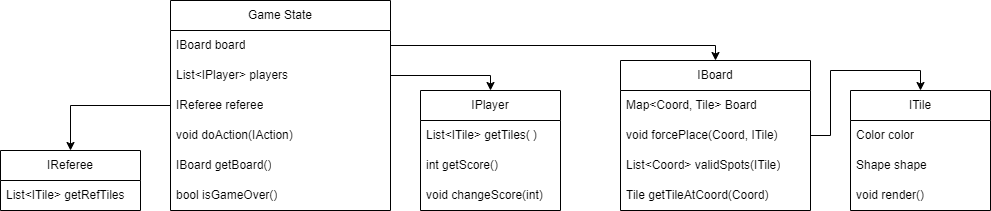

# Game State Data Representation

The game state will be represented as a class that implements a game state interface.

Rough Implementation Idea:


Data Representation:

The game state interface will allow the referee to grant turns to players with the `doAction()` method. This method will obtain an action from the player whose turn it is. 

The game state will include the board as an interface `IMap`. The tile placements will be represented as a `Map<Coord, ITile>` that maps two-dimensional coordinates to tiles that are placed on the board. A `Hashmap` can be used within the board class. An `ITile` can return its shape and color.

Wish List

```java
/** 
 * The GameState represents the game at a specific moment.
 *
 * This is meant to be implemented with a class that holds
 * references to the player, referee, observers, and board.
 * 
 */
interface GameState {
  // perform a player's action, with the referee's approval
  void doAction(IAction);
  

  /**
   * Returns the map.
   * 
   * The referee will be able to check the validity of a 
   * move by using the `validSpots()` method of the board 
   * to determine if the tile can be placed at the spot the 
   * player requested. The referee will be able to 
   * determine if the player can exchange tiles depending 
   * on the number of tiles the referee has.
   * 
   * */
  IMap getMap();

  /**
   * The game state will also indicate whether the game is 
   * over with the `isGameOver()` method. It will check if 
   * everyone has passed with an internal boolean that is  
   * updated with every player's turn. The method will also 
   * indicate a game over when a player places all tiles in 
   * its possession using the `List<ITiles>` returned by a 
   * player's `getTiles` method. The game state will use 
   * its `List<IPlayer>` to determine whether there are any 
   * players left at the end of a round. 
   */
  boolean isGameOver();
}

```